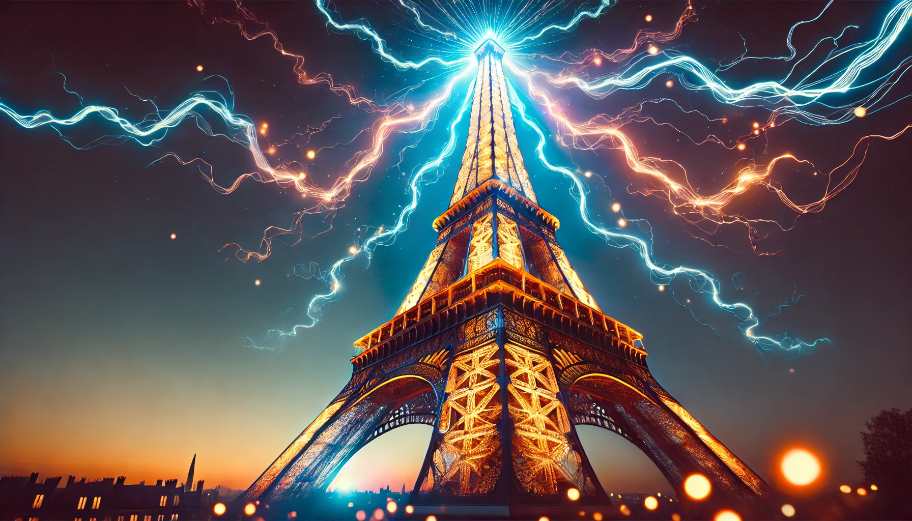

# Électricité

Le bloc de électricité se découpe en plusieurs chapitres:

* Cicuits linéaires dans le cadre de l'ARQS
  * [Puissance maximale reçue par une résistance](../exercices/elec/puissance_maximale.md)
  * [Tension au milieu d'un circuit](../exercices/elec/tension_centrale_E1_R1_R2_E2.md)
* Circuits du premier ordre
  * [Décharge circuit RC série](../exercices/elec/decharge_RC_analyse_energetique.md)
  * [Charge d'un circuit RC parallèle](../exercices/elec/charge_circuit_RC_parallele.md)
* Oscillateurs amortis
  * [Analyse énergétique d'un circuit RLC série](../exercices/elec/RLC_energie.md)
* Oscillations forcées
  * [Analyse énergétique d'un circuit RLC série](../exercices/elec/RLC_en_RSF.md)
* Filtrage linéaire
