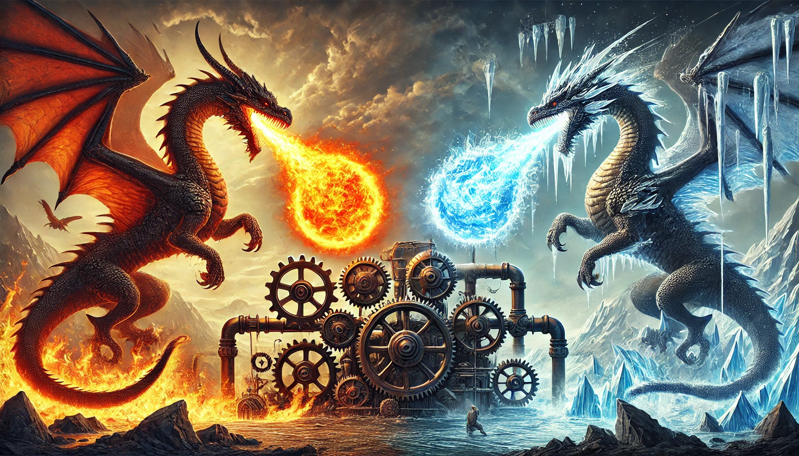

# Thermodynamique

Le bloc de thermodynamique se découpe en plusieurs chapitres:

* Statique des fluides
* Description microscopique et macroscopique d'un système à l'équilibre
* Fluides réels, phases condensées et changements d'état
* Énergie échangée par un système au cours d'une transformation
* Premier principe de la thermodynamique: bilans d'énergie
* Deuxième principe de la thermodynamique: bilans d'entropie
* Machines thermiques
