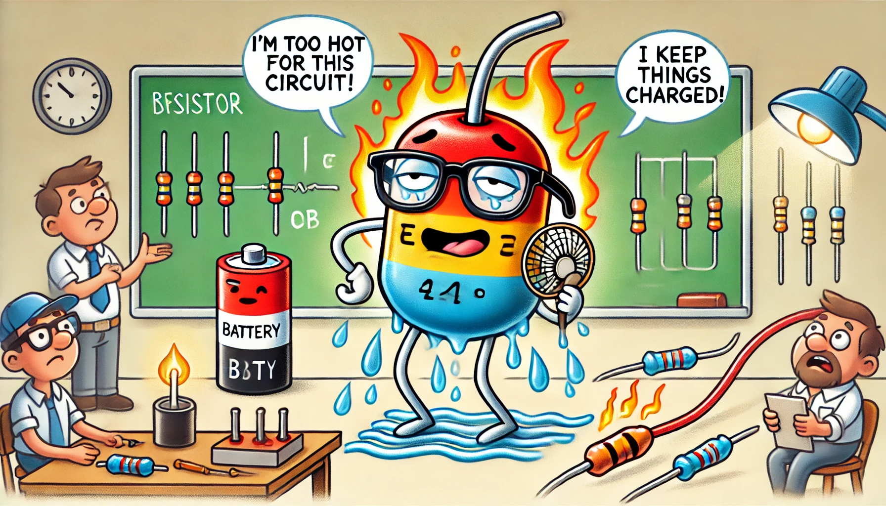

# Analyse énergétique de la décharge libre d'un circuit RLC

## Énoncé

On considère un circuit RLC série composé d'une résistance $$R$$, d'une inductance $$L$$, et d'une capacité $$C$$, initialement chargé à une tension initiale $$u_C(0) = U_0$$. À $$t = 0$$, on ferme l'interrupteur, et le circuit commence à se décharger.

1. **Équation différentielle** : Établissez l'équation différentielle régissant la tension $$u_C(t)$$ aux bornes du condensateur.
2. **Pulsation propre et facteur de qualité** : Déterminez la pulsation propre $$\omega_0$$ et le facteur de qualité $$Q$$ du circuit.
3. **Solution générale** : Trouvez l'expression de la tension $$u_C(t)$$ et du courant $$i(t)$$ au cours de la décharge.
4. **Énergie totale initiale** : Calculez l'énergie totale initialement emmagasinée dans le circuit.
5. **Évolution de l'énergie** : Déterminez comment l'énergie totale évolue dans le temps et identifiez les mécanismes de dissipation.

## Corrigé

### 1. Équation différentielle

Pour un circuit RLC série, la loi des mailles s'écrit :

$$ 
u_R(t) + u_L(t) + u_C(t) = 0 
$$

où :

- $$ u_R(t) = R i(t) $$ est la tension aux bornes de la résistance,
- $$ u_L(t) = L \frac{di(t)}{dt} $$ est la tension aux bornes de l'inductance,
- $$ u_C(t) $$ est la tension aux bornes du condensateur.

En utilisant la relation entre le courant et la tension du condensateur, $$ i(t) = C \frac{du_C(t)}{dt} $$, l'équation de la loi des mailles devient :

$$
R C \frac{du_C(t)}{dt} + L C \frac{d^2u_C(t)}{dt^2} + u_C(t) = 0
$$

En divisant par $$LC$$, on obtient l'équation différentielle normalisée :

$$
\frac{d^2u_C(t)}{dt^2} + \frac{R}{L} \frac{du_C(t)}{dt} + \frac{1}{LC} u_C(t) = 0
$$

### 2. Pulsation propre et facteur de qualité

La pulsation propre $$\omega_0$$ et le facteur de qualité $$Q$$ sont définis par :

\[
\omega_0 = \frac{1}{\sqrt{LC}}
\]

\[
Q = \frac{1}{R} \sqrt{\frac{L}{C}}
\]

#### Vérification dimensionnelle :

- Pour l'inductance : La loi de l'induction de Faraday donne $$ u_L = L \frac{di}{dt} $$, donc $$ [L] = \frac{[U][T]}{[I]} $$ où $$[U]$$ est la tension, $$[T]$$ est le temps, et $$[I]$$ est le courant.

- Pour la capacité : La relation capacitive donne $$ i = C \frac{du}{dt} $$, donc $$ [C] = \frac{[I][T]}{[U]} $$.

En combinant ces dimensions :

- $$[L] = [M][L^2][T^{-2}][I^{-1}]$$
- $$[C] = [T][I][U^{-1}]$$

Donc, le produit $$LC$$ a pour dimension :

$$ 
[LC] = \left([M][L^2][T^{-2}][I^{-1}]\right) \cdot \left([T][I][U^{-1}]\right) = [T^2]
$$

Ainsi, $$\omega_0 = \frac{1}{\sqrt{LC}}$$ a bien la dimension de $$[T^{-1}]$$, confirmant que $$\omega_0$$ est une fréquence.

### 3. Solution générale en régime de sur-amortissement

En régime de sur-amortissement, le discriminant de l'équation caractéristique est positif :

\[
Q < \frac{1}{2}
\]

Les racines de l'équation caractéristique sont réelles :

\[
\lambda_{1,2} = -\frac{R}{2L} \pm \sqrt{\left(\frac{R}{2L}\right)^2 - \frac{1}{LC}}
\]

Ce qui donne :

\[
\lambda_1 = -\frac{R}{2L} + \sqrt{\frac{R^2}{4L^2} - \frac{1}{LC}}
\]

\[
\lambda_2 = -\frac{R}{2L} - \sqrt{\frac{R^2}{4L^2} - \frac{1}{LC}}
\]

La solution générale est :

\[
u_C(t) = A e^{\lambda_1 t} + B e^{\lambda_2 t}
\]

#### Conditions initiales

- $$u_C(0) = U_0$$
- $$i(0) = C \frac{du_C}{dt}\bigg|_{t=0} = 0$$

**Condition initiale sur la tension :**

\[
u_C(0) = A + B = U_0
\]

**Condition initiale sur le courant :**

\[
\frac{du_C}{dt}\bigg|_{t=0} = A \lambda_1 + B \lambda_2 = 0
\]

Résolvons le système d'équations :

1. \(A + B = U_0\)
2. \(A \lambda_1 + B \lambda_2 = 0\)

De la deuxième équation, on a :

\[
A \lambda_1 + B \lambda_2 = 0 \implies A = -B \frac{\lambda_2}{\lambda_1}
\]

En substituant dans la première équation :

\[
-B \frac{\lambda_2}{\lambda_1} + B = U_0
\]

\[
B \left(1 - \frac{\lambda_2}{\lambda_1}\right) = U_0
\]

\[
B = \frac{U_0}{1 - \frac{\lambda_2}{\lambda_1}} = \frac{U_0 \lambda_1}{\lambda_1 - \lambda_2}
\]

Ainsi, pour \(A\), on a :

\[
A = -B \frac{\lambda_2}{\lambda_1} = -\frac{U_0 \lambda_2}{\lambda_1 - \lambda_2}
\]

### 4. Énergie totale initiale

L'énergie totale initiale emmagasinée dans le circuit est stockée dans le condensateur :

\[
E_{\text{initiale}} = \frac{1}{2} C U_0^2
\]

### 5. Évolution de l'énergie dans le circuit

L'énergie totale dans le circuit à un instant \(t\) est la somme de l'énergie dans le condensateur et de l'énergie dans l'inductance :

#### Énergie dans le condensateur :

\[
E_C(t) = \frac{1}{2} C u_C(t)^2 = \frac{1}{2} C \left(A e^{\lambda_1 t} + B e^{\lambda_2 t}\right)^2
\]

#### Énergie dans l'inductance :

Le courant dans le circuit est donné par :

\[
i(t) = C \frac{du_C(t)}{dt} = C \left(A \lambda_1 e^{\lambda_1 t} + B \lambda_2 e^{\lambda_2 t}\right)
\]

Donc, l'énergie dans l'inductance est :

\[
E_L(t) = \frac{1}{2} L i(t)^2 = \frac{1}{2} L \left(C \left(A \lambda_1 e^{\lambda_1 t} + B \lambda_2 e^{\lambda_2 t}\right)\right)^2
\]

#### Énergie totale dans le circuit :

\[
E_{\text{totale}}(t) = E_C(t) + E_L(t)
\]

\[
E_{\text{totale}}(t) = \frac{1}{2} C \left(A e^{\lambda_1 t} + B e^{\lambda_2 t}\right)^2 + \frac{1}{2} L \left(C \left(A \lambda_1 e^{\lambda_1 t} + B \lambda_2 e^{\lambda_2 t}\right)\right)^2
\]

### 6. Énergie dissipée par la résistance

L'énergie dissipée par la résistance est égale à la diminution de l'énergie totale par rapport à l'énergie initiale :

\[
E_R(t) = E_{\text{initiale}} - E_{\text{totale}}(t)
\]

\[
E_R(t) = \frac{1}{2} C U_0^2 - \left(\frac{1}{2} C \left(A e^{\lambda_1 t} + B e^{\lambda_2 t}\right)^2 + \frac{1}{2} L \left(C \left(A \lambda_1 e^{\lambda_1 t} + B \lambda_2 e^{\lambda_2 t}\right)\right)^2\right)
\]

## Questions d'analyse

1. **Méthode** : Pourquoi l'équation de décharge est-elle analogue à celle d'un oscillateur harmonique amorti ?

2. **Pulsation propre et facteur de qualité** : Expliquez le rôle de $$\omega_0$$ et $$Q$$ dans la dynamique du circuit.

3. **Cohérence dimensionnelle** : Vérifiez la cohérence dimensionnelle de l'expression pour $$\omega_0$$ à partir des équations des composants.

4. **Comparaison des régimes** : Quelles sont les implications physiques des différents régimes d'amortissement ?

5. **Énergie dissipée** : Décrivez l'évolution de l'énergie dissipée dans le circuit et identifiez les variables qui influencent cette dissipation.

## Corrigé des questions d'analyse

1. **Méthode** : L'équation de décharge d'un circuit RLC série est analogue à celle d'un oscillateur harmonique amorti parce que les termes de l'équation différentielle sont similaires : un terme d'accélération (ou de deuxième dérivée), un terme de vitesse (ou de première dérivée), et un terme de position (ou la variable elle-même). Cette structure est caractéristique des systèmes oscillatoires soumis à une force de rappel et un amortissement.

2. **Pulsation propre et facteur de qualité** : La pulsation propre $$\omega_0$$ définit la fréquence à laquelle le circuit oscillerait en absence de résistance. Le facteur de qualité $$Q$$ mesure la proportion de l'énergie emmagasinée dans le circuit par rapport à l'énergie dissipée par cycle. Un $$Q$$ élevé signifie que le circuit oscille avec peu de perte d'énergie, alors qu'un $$Q$$ faible signifie un amortissement rapide des oscillations.

3. **Cohérence dimensionnelle** : Pour vérifier la cohérence dimensionnelle de $$\omega_0 = \frac{1}{\sqrt{LC}}$$, utilisons les relations suivantes :

   - Pour l'inductance : La loi de l'induction de Faraday donne $$ u_L = L \frac{di}{dt} $$, donc $$ [L] = \frac{[U][T]}{[I]} $$ où $$[U]$$ est la tension, $$[T]$$ est le temps, et $$[I]$$ est le courant.
   - Pour la capacité : La relation capacitive donne $$ i = C \frac{du}{dt} $$, donc $$ [C] = \frac{[I][T]}{[U]} $$.

   En combinant ces dimensions :

   - $$[L] = [M][L^2][T^{-2}][I^{-1}]$$
   - $$[C] = [T][I][U^{-1}]$$

   Donc, le produit $$LC$$ a pour dimension :

   $$ 
   [LC] = \left([M][L^2][T^{-2}][I^{-1}]\right) \cdot \left([T][I][U^{-1}]\right) = [T^2]
   $$

   Ainsi, $$\omega_0 = \frac{1}{\sqrt{LC}}$$ a bien la dimension de $$[T^{-1}]$$, confirmant que $$\omega_0$$ est une fréquence.

4. **Comparaison des régimes** : 

   - **Sous-amortissement** : Le circuit oscille avec des oscillations amorties. C'est typique des circuits avec une faible résistance.
   - **Amortissement critique** : Le circuit atteint le seuil entre oscillation et décroissance exponentielle. C'est idéal pour éviter les oscillations prolongées.
   - **Sur-amortissement** : Le circuit revient à l'équilibre sans oscillations. Ce régime est lent et se produit dans les circuits avec une résistance élevée.

5. **Énergie dissipée** : L'énergie dissipée dans le circuit provient des pertes résistives, décrites par l'énergie dissipée par la résistance. Le taux de dissipation dépend des valeurs de $$R$$, $$L$$, et $$C$$. L'énergie initialement stockée dans le condensateur diminue progressivement, étant convertie en chaleur par effet Joule.
