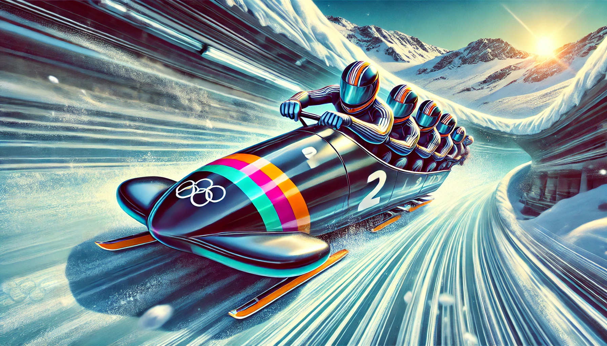

# Ralentissement des Bobsleighs par Champs Magnétiques Alternés

## Énoncé

On considère un bobsleigh en descente sur une piste. Ce bobsleigh est un cadre métallique conducteur de résistance électrique $$R$$. Pour ralentir le bobsleigh, la piste est équipée de zones de champ magnétique intense alternées avec des zones de champ magnétique nul. Les champs magnétiques sont perpendiculaires à la piste.

Lorsque le bobsleigh traverse une zone de champ magnétique, un courant est induit dans le cadre métallique, ce qui génère une force de Lorentz opposée au mouvement, ralentissant ainsi le bobsleigh.

Supposons que chaque zone de champ magnétique a une longueur $$L$$ et qu’un champ magnétique uniforme $$B$$ est appliqué dans ces zones. Le bobsleigh a une vitesse initiale $$v_0$$ en entrant dans la première zone magnétique et une masse totale $$m$$.

1. **Force de Lorentz induite** : Établissez l'expression de la force de Lorentz induite sur le bobsleigh lorsqu'il entre dans une zone de champ magnétique.

2. **Courant induit** : Déterminez l'expression du courant induit dans le cadre métallique du bobsleigh lorsqu'il se déplace dans une zone magnétique.

3. **Équation du mouvement** : Écrivez l'équation du mouvement du bobsleigh dans une zone magnétique en considérant la force de Lorentz.

4. **Variation de vitesse** : Calculez la variation de vitesse du bobsleigh après avoir traversé une zone magnétique de longueur $$L$$.

5. **Puissance dissipée** : Calculez la puissance électrique dissipée par effet Joule dans le cadre métallique lorsque le bobsleigh traverse une zone magnétique.

6. **Incertitudes et optimisation** : Discutez des sources d'incertitudes dans le modèle et proposez des moyens pour optimiser le ralentissement du bobsleigh.

## Corrigé

### 1. Force de Lorentz induite

La force de Lorentz $$\vec{F}_L$$ agissant sur le cadre métallique du bobsleigh est donnée par la formule :

$$
\vec{F}_L = -\int (\vec{I} \times \vec{B}) \, d\vec{l}
$$

Pour un bobsleigh de largeur $$w$$ en mouvement à travers un champ magnétique uniforme $$\vec{B} = B \vec{e}_z$$, la force est :

$$
F_L = -I B w
$$

où $$I$$ est le courant induit dans le cadre et $$\vec{e}_z$$ est le vecteur unitaire perpendiculaire à la surface du cadre.

### 2. Courant induit

Le courant induit $$I$$ dans le cadre est lié à la force électromotrice induite $$\mathcal{E}$$ par :

$$
I = \frac{\mathcal{E}}{R}
$$

La force électromotrice induite est donnée par la loi de Faraday :

$$
\mathcal{E} = -\frac{d\Phi}{dt}
$$

où $$\Phi = B \cdot w \cdot L$$ est le flux magnétique traversant le cadre. En considérant que le bobsleigh traverse le champ magnétique à une vitesse $$v$$, la variation du flux magnétique est :

$$
\frac{d\Phi}{dt} = B \cdot w \cdot v
$$

Ainsi, le courant induit est :

$$
I = \frac{B w v}{R}
$$

### 3. Équation du mouvement

La force de Lorentz ralentit le bobsleigh, et l'équation du mouvement dans une zone magnétique est :

$$
m \frac{dv}{dt} = -F_L = \frac{B^2 w^2 v}{R}
$$

où $$m$$ est la masse du bobsleigh.

### 4. Variation de vitesse

En intégrant l'équation du mouvement sur la durée de traversée de la zone magnétique $$t = \frac{L}{v}$$, on obtient la variation de vitesse :

$$
\int_{v_0}^{v} m \, dv = -\int_{0}^{t} \frac{B^2 w^2 v}{R} \, dt
$$

La solution est :

$$
v(t) = v_0 \cdot \exp\left(-\frac{B^2 w^2 L}{m R v_0}\right)
$$

La variation de vitesse après avoir traversé une zone est donc :

$$
\Delta v = v_0 \left(1 - \exp\left(-\frac{B^2 w^2 L}{m R v_0}\right)\right)
$$

### 5. Puissance dissipée

La puissance dissipée par effet Joule dans le cadre métallique est donnée par :

$$
P = I^2 R = \left(\frac{B w v}{R}\right)^2 R = \frac{B^2 w^2 v^2}{R}
$$

Cette puissance est dissipée sous forme de chaleur, contribuant au ralentissement du bobsleigh.

### 6. Incertitudes et optimisation

#### Sources d'incertitudes

- **Variation de la résistance** : La résistance du cadre peut varier avec la température.
- **Non-uniformité du champ magnétique** : Des variations dans l'intensité et l'orientation du champ peuvent affecter la force de Lorentz.
- **Vitesse initiale** : Des incertitudes sur la vitesse initiale peuvent entraîner des erreurs dans le calcul de la variation de vitesse.

#### Optimisation

- **Champ magnétique contrôlé** : Utiliser des électroaimants avec un contrôle précis du champ pour maintenir une intensité constante.
- **Matériaux à faible résistance** : Utiliser des matériaux conducteurs avec une résistance minimale pour maximiser la force de Lorentz et la dissipation d'énergie.
- **Disposition optimale des champs** : Positionner les zones de champ magnétique de manière stratégique pour maximiser le ralentissement tout en maintenant la stabilité du bobsleigh.

## Questions d'analyse

1. **Méthode** : Pourquoi la force de Lorentz induite est-elle proportionnelle à la vitesse du bobsleigh et au champ magnétique ?

2. **Impact de la résistance** : Comment la résistance $$R$$ du cadre métallique influence-t-elle le ralentissement du bobsleigh ?

3. **Optimisation énergétique** : Quels ajustements pourraient être apportés à la longueur des zones de champ magnétique pour maximiser le ralentissement sans compromettre la stabilité du bobsleigh ?

4. **Comparaison avec d'autres systèmes** : Comparez l'efficacité du ralentissement par champ magnétique avec celle des systèmes de freinage traditionnels.

5. **Influence de la vitesse** : Comment la vitesse initiale $$v_0$$ affecte-t-elle la force de freinage et la puissance dissipée ?

## Corrigé des questions d'analyse

1. **Méthode** : La force de Lorentz est proportionnelle à la vitesse car le courant induit est directement lié à la vitesse de variation du flux magnétique. Plus la vitesse est élevée, plus la force de Lorentz est importante. De même, un champ magnétique plus intense augmente le flux et donc le courant, augmentant la force de freinage.

2. **Impact de la résistance** : Une résistance $$R$$ élevée réduit le courant induit, diminuant ainsi la force de Lorentz et le ralentissement. Pour maximiser l'effet de freinage, une résistance plus faible est préférable.

3. **Optimisation énergétique** : Augmenter la longueur des zones de champ magnétique permet un ralentissement plus progressif et stable, réduisant les à-coups. Cependant, il faut veiller à ce que les champs restent uniformes sur toute la longueur pour éviter les variations de force.

4. **Comparaison avec d'autres systèmes** : Les systèmes de freinage magnétique présentent l'avantage de ne pas avoir de pièces mobiles en contact, réduisant ainsi l'usure et la maintenance. Ils sont également silencieux et peuvent être plus efficaces à haute vitesse que les freins mécaniques traditionnels.

5. **Influence de la vitesse** : Une vitesse initiale $$v_0$$ plus élevée augmente la force de freinage car le courant induit est plus fort. Cependant, cela peut également conduire à une dissipation énergétique plus rapide, nécessitant une gestion précise de la température pour éviter la surchauffe du cadre.
