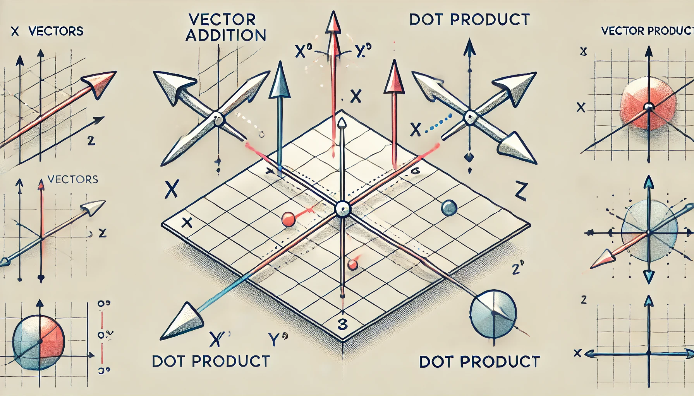

# Addition de vecteurs et produit scalaire dans une base orthonormée

## Énoncé

Considérez deux vecteurs $$ \vec{A} $$ et $$ \vec{B} $$ dans une base orthonormée, définis par leurs composantes :
- $$ \vec{A} = (3, 4) $$
- $$ \vec{B} = (1, 2) $$

1. Calculez la somme des deux vecteurs $$ \vec{C} = \vec{A} + \vec{B} $$.
2. Déterminez le produit scalaire $$ \vec{A} \cdot \vec{B} $$.
3. Calculez la norme de chaque vecteur.
4. Montrez que le produit scalaire peut aussi être calculé en utilisant les normes des vecteurs et l'angle $$ \theta $$ entre eux.

## Corrigé

1. **Calcul de la somme des deux vecteurs** :

   La somme des vecteurs $$ \vec{A} $$ et $$ \vec{B} $$ est donnée par l'addition des composantes correspondantes :
   $$
   \vec{C} = \vec{A} + \vec{B} = (A_x + B_x, A_y + B_y)
   $$

   En remplaçant les valeurs données :
   $$
   \vec{C} = (3 + 1, 4 + 2) = (4, 6)
   $$

2. **Détermination du produit scalaire** :

   Le produit scalaire $$ \vec{A} \cdot \vec{B} $$ est donné par :
   $$
   \vec{A} \cdot \vec{B} = A_x B_x + A_y B_y
   $$

   En remplaçant les valeurs données :
   $$
   \vec{A} \cdot \vec{B} = 3 \times 1 + 4 \times 2 = 3 + 8 = 11
   $$

3. **Calcul de la norme de chaque vecteur** :

   La norme d'un vecteur $$ \vec{A} = (A_x, A_y) $$ est donnée par :
   $$
   \| \vec{A} \| = \sqrt{A_x^2 + A_y^2}
   $$

   En remplaçant les valeurs de $$ \vec{A} $$ :
   $$
   \| \vec{A} \| = \sqrt{3^2 + 4^2} = \sqrt{9 + 16} = \sqrt{25} = 5
   $$

   Pour le vecteur $$ \vec{B} $$ :
   $$
   \| \vec{B} \| = \sqrt{1^2 + 2^2} = \sqrt{1 + 4} = \sqrt{5}
   $$

4. **Produit scalaire en utilisant les normes et l'angle $$ \theta $$ entre les vecteurs** :

   Le produit scalaire peut également être exprimé en fonction des normes des vecteurs et de l'angle $$ \theta $$ entre eux :
   $$
   \vec{A} \cdot \vec{B} = \| \vec{A} \| \| \vec{B} \| \cos \theta
   $$

   Nous savons déjà que $$ \vec{A} \cdot \vec{B} = 11 $$, $$ \| \vec{A} \| = 5 $$, et $$ \| \vec{B} \| = \sqrt{5} $$.
   Pour trouver $$ \cos \theta $$ :
   $$
   \cos \theta = \frac{\vec{A} \cdot \vec{B}}{\| \vec{A} \| \| \vec{B} \|} = \frac{11}{5 \sqrt{5}} = \frac{11}{5 \sqrt{5}} \times \frac{\sqrt{5}}{\sqrt{5}} = \frac{11 \sqrt{5}}{25}
   $$

   Ainsi, l'angle $$ \theta $$ entre les vecteurs peut être trouvé en prenant l'arc cosinus :
   $$
   \theta = \cos^{-1} \left( \frac{11 \sqrt{5}}{25} \right)
   $$

## Questions d'analyse

1. Pourquoi l'addition des vecteurs se fait-elle en additionnant les composantes correspondantes ?
2. Expliquez pourquoi le produit scalaire de deux vecteurs peut être négatif, nul ou positif.
3. Quel est le lien entre le produit scalaire et l'orthogonalité des vecteurs ?
4. Si $$ \vec{A} $$ et $$ \vec{B} $$ étaient colinéaires, comment cela affecterait-il leur produit scalaire ?
5. Montrez comment on peut retrouver la norme d'un vecteur à partir de son produit scalaire avec lui-même.

## Corrigé des questions d'analyse

1. L'addition des vecteurs se fait en additionnant les composantes correspondantes car chaque composante représente une direction dans l'espace, et l'addition de vecteurs est la combinaison de leurs contributions dans chaque direction.
2. Le produit scalaire de deux vecteurs peut être négatif si l'angle entre eux est supérieur à 90 degrés, nul si les vecteurs sont orthogonaux (angle de 90 degrés), et positif si l'angle est inférieur à 90 degrés.
3. Le produit scalaire est lié à l'orthogonalité des vecteurs car s'il est nul, cela signifie que les vecteurs sont perpendiculaires, c'est-à-dire qu'ils forment un angle de 90 degrés entre eux.
4. Si $$ \vec{A} $$ et $$ \vec{B} $$ étaient colinéaires, leur produit scalaire serait égal au produit des normes de ces vecteurs multiplié par $$ \cos(0) $$ ou $$ \cos(180) $$, ce qui donne respectivement $$ \| \vec{A} \| \| \vec{B} \| $$ ou $$ -\| \vec{A} \| \| \vec{B} \| $$.
5. La norme d'un vecteur peut être retrouvée à partir de son produit scalaire avec lui-même :
   $$
   \| \vec{A} \| = \sqrt{\vec{A} \cdot \vec{A}} = \sqrt{A_x^2 + A_y^2}
   $$
   Ce qui revient à la définition de la norme d'un vecteur.

