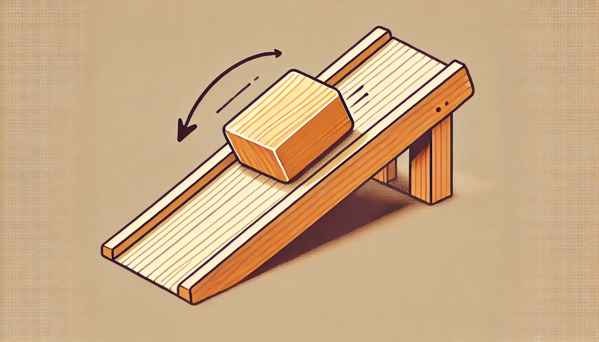

# Mouvement d'une masse le long d'un plan incliné avec et sans frottement

## Énoncé

Considérez une masse $$ m = 5 \, \text{kg} $$ qui glisse le long d'un plan incliné faisant un angle $$ \theta = 30^\circ $$ avec l'horizontale. La masse est soumise à la force de gravité, et nous allons examiner deux cas : avec et sans frottement solide. Le coefficient de frottement solide est $$ \mu = 0.3 $$.

1. Calculez l'accélération de la masse sans frottement.
2. Calculez l'accélération de la masse avec frottement solide.
3. Déterminez la vitesse de la masse après avoir parcouru une distance de $$ d = 10 \, \text{m} $$ sur le plan incliné, dans les deux cas.
4. Comparez les résultats obtenus pour la vitesse avec et sans frottement.

## Corrigé

1. **Calcul de l'accélération sans frottement** :

   La force de gravité parallèle au plan incliné est donnée par :
   $$
   F_{\parallel} = mg \sin \theta
   $$

   La composante perpendiculaire de la force de gravité ne contribue pas au mouvement le long du plan incliné.

   L'accélération $$ a $$ de la masse est donnée par la deuxième loi de Newton :
   $$
   F = ma \implies mg \sin \theta = ma \implies a = g \sin \theta
   $$

   En remplaçant les valeurs données :
   $$
   a = 9.81 \, \text{m/s}^2 \times \sin 30^\circ = 9.81 \, \text{m/s}^2 \times 0.5 = 4.905 \, \text{m/s}^2
   $$

2. **Calcul de l'accélération avec frottement solide** :

   La force de frottement $$ F_f $$ est donnée par :
   $$
   F_f = \mu N = \mu mg \cos \theta
   $$

   La force normale $$ N $$ est :
   $$
   N = mg \cos \theta
   $$

   La force nette parallèle au plan incliné est :
   $$
   F_{\parallel} = mg \sin \theta - F_f = mg \sin \theta - \mu mg \cos \theta
   $$

   L'accélération $$ a' $$ est :
   $$
   F_{\parallel} = ma' \implies mg \sin \theta - \mu mg \cos \theta = ma' \implies a' = g (\sin \theta - \mu \cos \theta)
   $$

   En remplaçant les valeurs données :
   $$
   a' = 9.81 \, \text{m/s}^2 (\sin 30^\circ - 0.3 \cos 30^\circ) = 9.81 \, \text{m/s}^2 (0.5 - 0.3 \times 0.866) = 9.81 \, \text{m/s}^2 (0.5 - 0.2598) = 9.81 \, \text{m/s}^2 \times 0.2402 \approx 2.355 \, \text{m/s}^2
   $$

3. **Calcul de la vitesse après avoir parcouru une distance $$ d = 10 \, \text{m} $$** :

   La vitesse finale $$ v $$ sans frottement est donnée par :
   $$
   v^2 = v_0^2 + 2ad
   $$

   En supposant que la masse commence à partir du repos ($$ v_0 = 0 $$):
   $$
   v^2 = 2ad \implies v = \sqrt{2 \times 4.905 \, \text{m/s}^2 \times 10 \, \text{m}} = \sqrt{98.1} \approx 9.9 \, \text{m/s}
   $$

   La vitesse finale $$ v' $$ avec frottement est donnée par :
   $$
   v'^2 = v_0^2 + 2a'd
   $$

   En remplaçant les valeurs :
   $$
   v'^2 = 2a'd \implies v' = \sqrt{2 \times 2.355 \, \text{m/s}^2 \times 10 \, \text{m}} = \sqrt{47.1} \approx 6.86 \, \text{m/s}
   $$

4. **Comparaison des résultats** :

   Sans frottement, la vitesse finale est de $$ 9.9 \, \text{m/s} $$.

   Avec frottement, la vitesse finale est de $$ 6.86 \, \text{m/s} $$.

   Le frottement réduit donc la vitesse finale de la masse après avoir parcouru la même distance.

## Questions d'analyse

1. Pourquoi la force de frottement réduit-elle l'accélération de la masse le long du plan incliné ?
2. Si l'angle du plan incliné était plus grand, comment cela affecterait-il l'accélération avec et sans frottement ?
3. Comment la masse de l'objet affecte-t-elle les résultats obtenus pour l'accélération et la vitesse finale ?
4. Si le coefficient de frottement était nul, quelle serait l'accélération de la masse ? Justifiez votre réponse.
5. Quel est l'effet du coefficient de frottement sur le mouvement de la masse et comment peut-on le minimiser dans une expérience pratique ?

## Corrigé des questions d'analyse

1. La force de frottement réduit l'accélération de la masse car elle agit dans le sens opposé au mouvement, diminuant ainsi la force nette parallèle au plan incliné.
2. Si l'angle du plan incliné était plus grand, l'accélération sans frottement augmenterait car la composante de la force gravitationnelle parallèle au plan incliné serait plus grande. Avec frottement, l'accélération augmenterait également, mais l'effet du frottement serait proportionnellement plus petit par rapport à la composante parallèle accrue.
3. La masse de l'objet n'affecte pas l'accélération car elle se simplifie dans les équations. Cependant, la force de frottement dépend de la masse, donc pour une masse plus grande, la force de frottement serait plus importante, mais l'accélération resterait la même.
4. Si le coefficient de frottement était nul, l'accélération de la masse serait simplement $$ g \sin \theta $$, car il n'y aurait aucune force opposée pour réduire l'accélération.
5. Le coefficient de frottement réduit la vitesse finale et l'accélération de la masse. Pour minimiser cet effet, on peut utiliser des surfaces lisses, lubrifier le plan incliné, ou utiliser des matériaux avec un coefficient de frottement plus faible.
