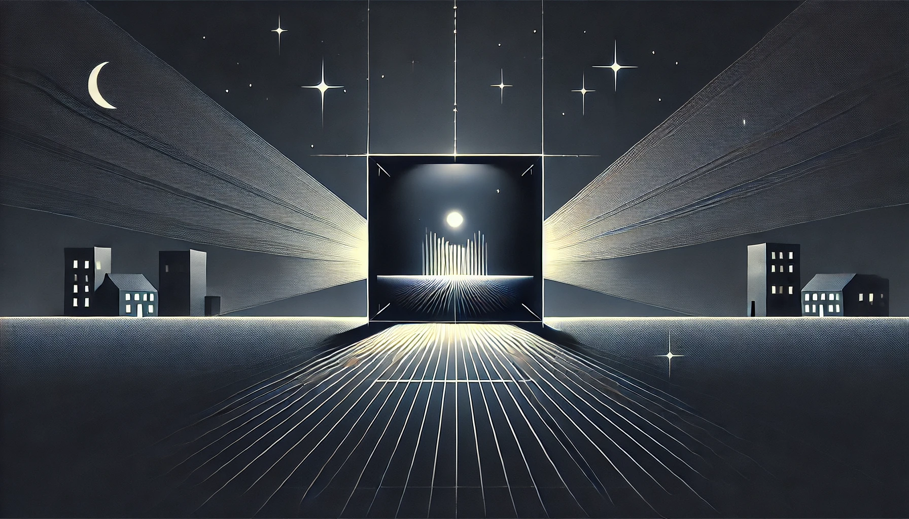

# Calcul avec une lentille divergente

## Énoncé

1. Une lentille divergente a une distance focale $$f = -20 \, \text{cm}$$. Un objet est placé à une distance de $$30 \, \text{cm}$$ de la lentille. Utilisez la formule de Descartes pour déterminer la position de l'image formée par la lentille.
2. Utilisez ensuite la formule de Newton pour vérifier la position de l'image.
3. Calculez le grandissement de l'image.

## Corrigé

1. **Utilisation de la formule de Descartes** :
   La formule de Descartes pour les lentilles est donnée par :
   $$
   \frac{1}{f} = \frac{1}{d_o} + \frac{1}{d_i}
   $$
   où :
   - $$f$$ est la distance focale de la lentille.
   - $$d_o$$ est la distance de l'objet à la lentille.
   - $$d_i$$ est la distance de l'image à la lentille.

   En remplaçant les valeurs données :
   $$
   \frac{1}{-20} = \frac{1}{30} + \frac{1}{d_i}
   $$

   Isolons $$\frac{1}{d_i}$$ :
   $$
   \frac{1}{d_i} = \frac{1}{-20} - \frac{1}{30}
   $$
   $$
   \frac{1}{d_i} = -\frac{3}{60} - \frac{2}{60} = -\frac{5}{60} = -\frac{1}{12}
   $$

   Donc,
   $$
   d_i = -12 \, \text{cm}
   $$

   L'image est formée à 12 cm de la lentille, du côté de l'objet (côté opposé de la sortie de la lumière).

2. **Utilisation de la formule de Newton** :
   La formule de Newton pour les lentilles est donnée par :
   $$
   x_o \cdot x_i = f^2
   $$
   où :
   - $$x_o = d_o - f$$ est la distance de l'objet au foyer objet.
   - $$x_i = d_i - f$$ est la distance de l'image au foyer image.

   En remplaçant les valeurs :
   $$
   x_o = 30 \, \text{cm} - (-20 \, \text{cm}) = 30 + 20 = 50 \, \text{cm}
   $$
   $$
   x_i = d_i - (-20) = d_i + 20
   $$

   En utilisant la formule de Newton :
   $$
   50 \cdot (d_i + 20) = (-20)^2
   $$
   $$
   50 \cdot (d_i + 20) = 400
   $$
   $$
   d_i + 20 = \frac{400}{50} = 8
   $$
   $$
   d_i = 8 - 20 = -12 \, \text{cm}
   $$

   Cela confirme que l'image est formée à 12 cm de la lentille, du côté de l'objet.

3. **Calcul du grandissement** :
   Le grandissement $$G$$ est donné par la formule :
   $$
   G = \frac{h_i}{h_o} = -\frac{d_i}{d_o}
   $$

   En remplaçant les valeurs :
   $$
   G = -\frac{-12}{30} = \frac{12}{30} = 0.4
   $$

   Le grandissement de l'image est 0.4, ce qui signifie que l'image est réduite et dans le même sens que l'objet.

## Questions d'analyse

1. Pourquoi la distance focale $$f$$ d'une lentille divergente est-elle négative ?
2. Que signifie un grandissement positif dans ce contexte ?
3. Si la distance de l'objet à la lentille était de 10 cm au lieu de 30 cm, comment cela affecterait-il la position de l'image et le grandissement ? Montrez vos calculs.
4. Pourquoi les résultats obtenus avec les formules de Descartes et de Newton doivent-ils être identiques ?
5. Quels sont les avantages et les inconvénients d'utiliser une lentille divergente pour former des images ?

## Corrigé des questions d'analyse

1. La distance focale $$f$$ d'une lentille divergente est négative car elle diverge les rayons lumineux, ce qui signifie que les foyers (objets et images) sont situés du côté opposé par rapport aux lentilles convergentes.
2. Un grandissement positif signifie que l'image formée est droite par rapport à l'objet. Dans ce contexte, une valeur inférieure à 1 indique que l'image est plus petite que l'objet.
3. Pour une distance de l'objet de 10 cm :
   - Utilisation de la formule de Descartes :
     $$
     \frac{1}{-20} = \frac{1}{10} + \frac{1}{d_i}
     $$
     $$
     \frac{1}{d_i} = \frac{1}{-20} - \frac{1}{10} = -\frac{1}{20} - \frac{2}{20} = -\frac{3}{20}
     $$
     $$
     d_i = -\frac{20}{3} \approx -6.67 \, \text{cm}
     $$
   - Utilisation de la formule de Newton :
     $$
     x_o = 10 - (-20) = 10 + 20 = 30 \, \text{cm}
     $$
     $$
     x_i = d_i + 20
     $$
     $$
     30 \cdot (d_i + 20) = (-20)^2
     $$
     $$
     30 \cdot (d_i + 20) = 400
     $$
     $$
     d_i + 20 = \frac{400}{30} \approx 13.33
     $$
     $$
     d_i = 13.33 - 20 = -6.67 \, \text{cm}
     $$
   - Calcul du grandissement :
     $$
     G = -\frac{d_i}{d_o} = -\frac{-6.67}{10} = 0.667
     $$
     L'image serait formée à environ -6.67 cm, et le grandissement serait de 0.667.
4. Les résultats obtenus avec les formules de Descartes et de Newton doivent être identiques car elles sont deux représentations mathématiques différentes du même phénomène physique de formation d'image par une lentille.
5. Les avantages d'utiliser une lentille divergente incluent la correction de myopie dans les lunettes et la réduction de l'image pour les faisceaux lumineux. Les inconvénients incluent le fait que les images formées sont toujours virtuelles, droites et plus petites, ce qui peut ne pas convenir à toutes les applications.
