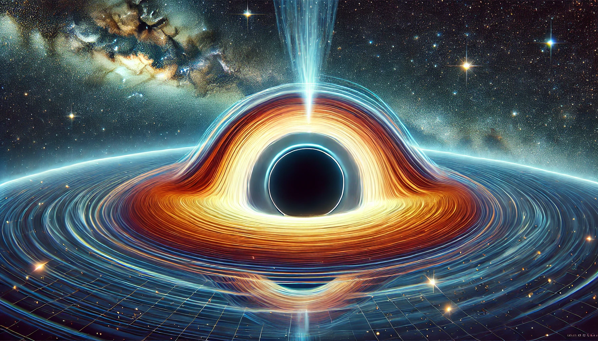

# Détermination du rayon de l'horizon d'un trou noir par analyse dimensionnelle

## Énoncé

1. En utilisant l'analyse dimensionnelle, déterminez l'expression du rayon de l'horizon d'un trou noir (appelé rayon de Schwarzschild) en fonction de la constante de gravitation $$G$$, de la vitesse de la lumière $$c$$ et de la masse $$M$$ du trou noir.
2. Expliquez pourquoi une telle approche est possible et quelles sont les limites de cette méthode.
3. Vérifiez que l'expression obtenue est homogène à une longueur.

## Corrigé

1. Le rayon de l'horizon d'un trou noir, ou rayon de Schwarzschild, peut être déterminé en utilisant une analyse dimensionnelle. Nous cherchons une expression de la forme :
   $$ R_s = k \cdot G^a \cdot c^b \cdot M^c $$
   où $$k$$ est une constante sans dimension.

   Les dimensions des grandeurs physiques sont :
   - $$[G] = \text{L}^3 \text{M}^{-1} \text{T}^{-2}$$
   - $$[c] = \text{L} \text{T}^{-1}$$
   - $$[M] = \text{M}$$
   - $$[R_s] = \text{L}$$

   Écrivons les dimensions de chaque terme de l'expression :
   $$
   [R_s] = \text{L}
   $$
   $$
   [G^a] = (\text{L}^3 \text{M}^{-1} \text{T}^{-2})^a = \text{L}^{3a} \text{M}^{-a} \text{T}^{-2a}
   $$
   $$
   [c^b] = (\text{L} \text{T}^{-1})^b = \text{L}^b \text{T}^{-b}
   $$
   $$
   [M^c] = \text{M}^c
   $$

   Pour que l'expression soit homogène, les dimensions doivent s'équilibrer :
   $$
   \text{L} = \text{L}^{3a + b} \text{M}^{c - a} \text{T}^{-2a - b}
   $$

   En égalant les puissances de chaque dimension, nous obtenons le système d'équations :
   $$
   \begin{cases}
   3a + b = 1 \\
   c - a = 0 \\
   -2a - b = 0
   \end{cases}
   $$

   Résolvons ce système :
   $$
   \begin{cases}
   c = a \\
   b = -2a \\
   3a - 2a = 1 \Rightarrow a = 1 \Rightarrow c = 1, b = -2
   \end{cases}
   $$

   Donc l'expression du rayon de Schwarzschild est :
   $$ R_s = k \cdot G^1 \cdot c^{-2} \cdot M^1 $$
   ou plus simplement :
   $$ R_s = k \frac{GM}{c^2} $$

   En prenant $k = 2$, qui est déterminé par des considérations plus précises de relativité générale, on obtient l'expression connue :
   $$ R_s = \frac{2GM}{c^2} $$

2. L'approche par analyse dimensionnelle est possible ici parce que le problème peut être réduit à une combinaison de grandeurs physiques fondamentales dont les dimensions se compensent pour donner une longueur. Les limites de cette méthode résident dans le fait qu'elle ne donne pas la constante numérique exacte (ici, 2), qui nécessite une dérivation plus précise via la théorie de la relativité générale.

3. Vérifions l'homogénéité de l'expression obtenue :
   $$
   [R_s] = \left[\frac{2GM}{c^2}\right] = \frac{[\text{L}^3 \text{M}^{-1} \text{T}^{-2} \cdot \text{M}]}{[\text{L}^2 \text{T}^{-2}]} = \frac{\text{L}^3 \text{T}^{-2}}{\text{L}^2 \text{T}^{-2}} = \text{L}
   $$

   L'expression est bien homogène à une longueur.

## Questions d'analyse

1. Pourquoi est-il légitime d'utiliser l'analyse dimensionnelle pour ce type de problème ?
2. Quels seraient les dangers d'une telle méthode dans un problème où d'autres paramètres physiques non considérés ici pourraient jouer un rôle important ?
3. Justifiez pourquoi $$k = 2$$ dans l'expression finale du rayon de Schwarzschild.
4. Dans l'étape de la vérification de l'homogénéité, pourquoi est-il crucial de vérifier chaque terme séparément ?

## Corrigé des questions d'analyse

1. L'analyse dimensionnelle est légitime ici car nous cherchons une relation entre des grandeurs physiques fondamentales dont les dimensions se compensent pour former une nouvelle grandeur (une longueur, en l'occurrence). Cela fonctionne bien dans ce cas car les seules variables pertinentes sont $G$, $c$ et $M$.
2. Les dangers d'une telle méthode apparaissent lorsqu'il existe d'autres paramètres significatifs non pris en compte. Par exemple, des effets quantiques ou des constantes supplémentaires spécifiques à des conditions particulières pourraient influencer le résultat final.
3. Le facteur $$k = 2$$ est déterminé par une analyse plus fine de la relativité générale. Il vient de la solution exacte des équations d'Einstein pour une masse ponctuelle non chargée et non rotative.
4. Vérifier chaque terme séparément dans la vérification de l'homogénéité est crucial pour s'assurer que toutes les dimensions sont correctement équilibrées. Toute erreur dans cette vérification peut indiquer une erreur dans la dérivation de l'expression finale.
